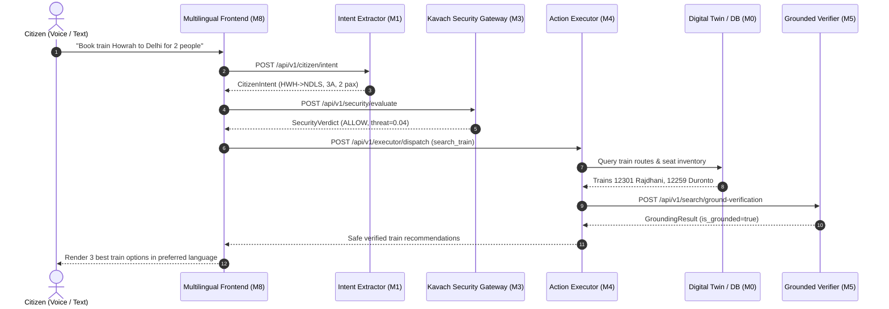
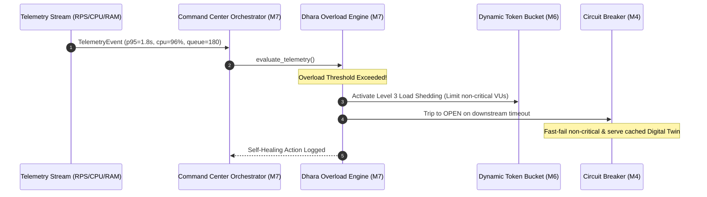

# 🏛️ NIRANTAR — System Architecture & Flow Diagrams

Mermaid diagrams illustrating key end-to-end workflows in the NIRANTAR platform.

---

## 1. End-to-End Citizen Journey Flow

---

## 2. Dhara Adaptive Self-Healing & Surge Shedding

