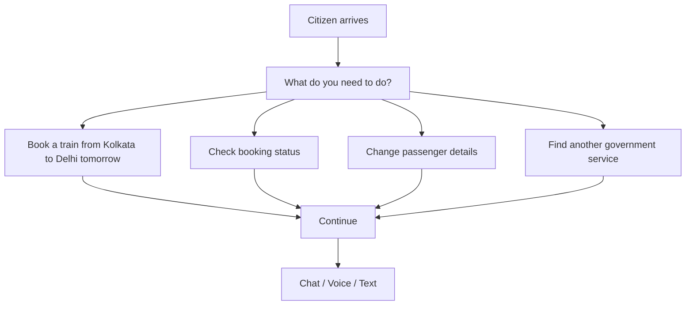

# NIRANTAR — Module 1: Citizen UX

> Canonical map: `docs/architecture/system.md`. Do not implement from this file until asked.

**Job:** Understand what the citizen is trying to do. Guide. Stay accessible. Downstream modules exist to serve this path.

### 1.1 Single Problem Statement

**Citizens know what they want to accomplish, but they do not know which service, option, form, or sequence of actions will get them there.**

**Concrete flagship journey (Train booking):**

User says:  
**"I want to book an overnight train from Kolkata to Delhi tomorrow."**

NIRANTAR must understand the intent and guide the citizen through the entire flow without forcing them to navigate a complex government portal.

### 1.2 Citizen Landing Page (Primary Interaction)

Simple, conversational, low-friction entry point.



**Design rules:**
- One clear question: **"What do you need to do?"**
- No giant menus. No forms on first screen.
- Popular tasks shown in a clean list.
- Input via natural language (text + voice).

### 1.3 Intent Extraction

Convert natural language into structured **CitizenIntent** (contracts/citizen.py)

```json
{
  "intent": "BOOK_TRAIN",
  "origin": "Kolkata",
  "destination": "Delhi",
  "date": "2026-08-23",
  "time_preference": "overnight",
  "passengers": 1,
  "class_preference": "3A",
  "language": "hi",
  "raw_query": "I want to book an overnight train from Kolkata to Delhi tomorrow."
}
```

**Extraction rules:**
- Use `MultilingualIntentExtractor` (offline, supports hi/bn/en)
- Station aliases must be canonical (HWH, NDLS, etc.)
- Confidence scoring + fallback to clarification if < 0.85

### 1.4 Human-Readable Confirmation (Critical Product Rule)

**Never silently assume.**

Show the citizen exactly what was understood:

```
I understood this as:

📅 Book a train
🛤️ Kolkata → Delhi
📅 Tomorrow
🛏️ Overnight
👥 1 passenger

[Correct]     [Edit]
```

This screen must be **non-skippable** on the first pass. This is the heart of good citizen experience design.

### 1.5 Guided Progressive Journey

The citizen journey must be **linear, guided, and minimal**.

```
Intent Extraction
         ↓
Search (stations + trains)
         ↓
Results (top 3-5 options)
         ↓
Select train
         ↓
Passenger details (1 passenger)
         ↓
Review & confirmation
         ↓
Mock payment / Payment gateway
         ↓
Final confirmation (PNR + ticket)
```

**Journey Stages (JourneyStage enum):**
- INTENT
- CONFIRM (non-skippable)
- SEARCH
- SELECT
- PASSENGER
- REVIEW
- PAY
- DONE

### 1.6 Integration with the rest of NIRANTAR

- **PORTALPULSE (Predict)** feeds real-time availability and overload signals
- **KAVACH (Trust)** runs session fingerprinting and bot detection
- **DHARA (Decide)** handles admission control, queues, and load shedding
- All telemetry flows back to Predict / Trust / Decide

### 1.7 Non-Goals (Module 1)

- No real IRCTC integration
- No paid LLM required (local-first)
- No 10K+ VUs yet (start with 1K → 5K ladder)
- No full production rollout

### Key Design Invariant

**The citizen must feel they are talking to a helpful assistant, not a government portal.**

### Mental Model Rules (from CLAUDE.md)
- Think before coding: state assumptions explicitly, ask if unclear.
- Simplicity first: minimum code, no over-abstraction.
- Surgical changes: only edit what fixes the reported issue.
- Goal-driven execution: define verifiable success criteria before each step.

---

**Next step recommendation:**  
This document is ready to be implemented as Module 1.  
Do you want to:
1. Add this as a new file in `docs/architecture/mental-model-module1.md` and continue with Module 2?
2. Or proceed directly to implementing the guided journey in the backend/frontend?

Let me know how you want to proceed. 
