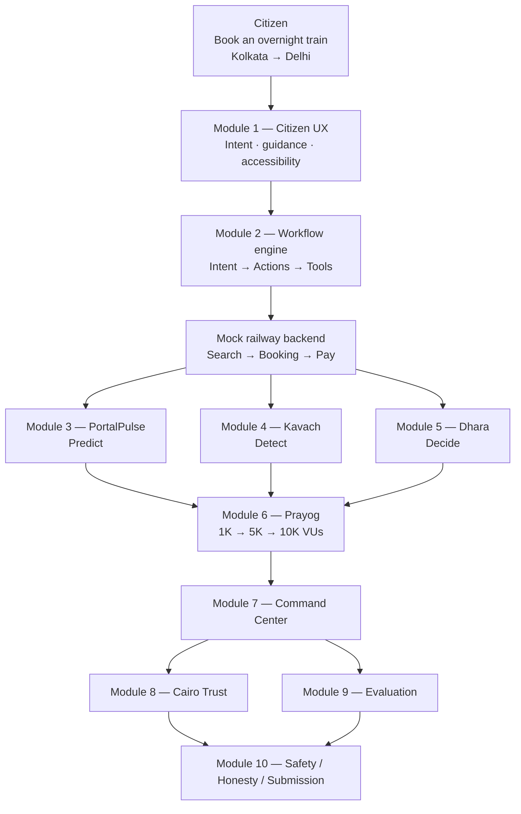

# NIRANTAR Architecture

> **Status:** FROZEN  
> **Map:** 10-module vertical stack (this file is the source of truth)  
> **Philosophy:** Local-first. External APIs are optional adapters. The LLM never admits traffic.  
> **Do not implement from this file until asked.**

---

## Canonical map

```
                         ┌──────────────────────────┐
                         │        CITIZEN            │
                         │                            │
                         │ "Book an overnight train  │
                         │  Kolkata → Delhi"          │
                         └────────────┬───────────────┘
                                      │
                                      ▼
                         ┌──────────────────────────┐
                         │       MODULE 1             │
                         │   NIRANTAR CITIZEN UX      │
                         │                            │
                         │ Intent understanding       │
                         │ Guidance / accessibility  │
                         └────────────┬───────────────┘
                                      │
                                      ▼
                         ┌──────────────────────────┐
                         │       MODULE 2             │
                         │    WORKFLOW ENGINE         │
                         │                            │
                         │ Intent → Actions → Tools  │
                         └────────────┬───────────────┘
                                      │
                                      ▼
                         ┌──────────────────────────┐
                         │      MOCK SERVICE          │
                         │    RAILWAY BACKEND         │
                         │                            │
                         │ Search → Booking → Pay    │
                         └────────────┬───────────────┘
                                      │
                     ┌────────────────┼────────────────┐
                     │                │                │
                     ▼                ▼                ▼
              MODULE 3          MODULE 4          MODULE 5
            PORTALPULSE          KAVACH             DHARA
              Predict             Detect             Decide
                     │                │                │
                     └────────────────┼────────────────┘
                                      │
                                      ▼
                         ┌──────────────────────────┐
                         │       MODULE 6             │
                         │   PRAYOG SIMULATION       │
                         │                            │
                         │ 1K → 5K → 10K VUs         │
                         └────────────┬───────────────┘
                                      │
                                      ▼
                         ┌──────────────────────────┐
                         │       MODULE 7             │
                         │    COMMAND CENTER          │
                         └──────────────────────────┘
                                      │
                         ┌────────────┴─────────────┐
                         ▼                          ▼
                    MODULE 8                   MODULE 9
                  CAIRO TRUST                EVALUATION
                         │                          │
                         └────────────┬─────────────┘
                                      ▼
                               MODULE 10
                           SAFETY / HONESTY /
                            SUBMISSION LAYER
```



---

## Module jobs

| # | Name | Job |
|---|------|-----|
| 1 | Citizen UX | Understand what the citizen is trying to do. Guide. Stay accessible. |
| 2 | Workflow engine | Compile intent into actions and restricted tools. Not the traffic brain. |
| — | Mock railway backend | The only public-service backend in this sandbox: Search → Booking → Pay. |
| 3 | PortalPulse | Predict demand, overload, and infrastructure state. |
| 4 | Kavach | Detect legitimate vs suspicious vs malicious traffic. Adaptive trust. |
| 5 | Dhara | Decide: queue, shed, protect inventory, admit. |
| 6 | Prayog | Prove the loop at 1K → 5K → 10K virtual users. Chaos stays in the lab. |
| 7 | Command Center | Operator surface. Observes the same state the citizen path produces. |
| 8 | Cairo Trust | Narrow verifiable proof. Not a general chain. |
| 9 | Evaluation | Measure whether the system is honest, resilient, and usable. |
| 10 | Safety / Honesty / Submission | Bounds, no live government data, submission-ready claims. |

---

## Invariants

1. Citizen never talks to infrastructure. They talk to Module 1.
2. Module 2 compiles language into actions. The LLM does not admit traffic.
3. PortalPulse / Kavach / Dhara sit under the mock backend and read infrastructure state.
4. Dhara is the only plane that changes admission, queues, and shedding.
5. Prayog hits the same mock layer the citizen hits.
6. Prove 1K before 5K before 10K.
7. Zero real citizen PII. No live government databases.

---

## Naming freeze

| Name | Means | Does not mean |
|------|--------|----------------|
| NIRANTAR | The product | A single module |
| PortalPulse | Predict (Module 3) | The whole product |
| Kavach | Detect / trust (Module 4) | Cairo alone |
| Dhara | Decide (Module 5) | Citizen-facing brand |
| Prayog | Simulation (Module 6) | Production traffic |

Older 5-box tech-stack diagrams (Frontend / Backend / AI) are retired. This map replaces them.
