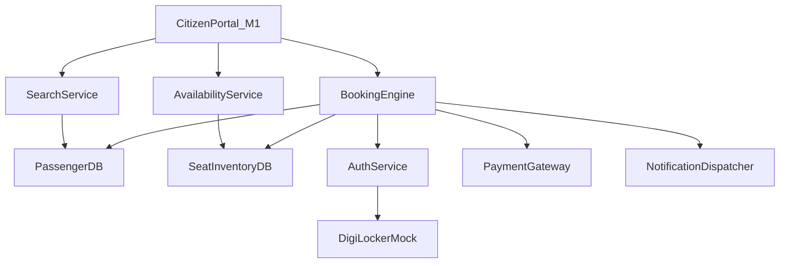

# NIRANTAR Module 0 — Foundation & Digital-Twin Environment

> **Status:** Production-Ready & Tested  
> **Owning Agent:** FORGE (Backend & Orchestration) + ORBIT (Architecture)  
> **Target System:** Synthetic Public-Service Digital Twin (IRCTC Tatkal & Civic Services)

---

## 🎯 Purpose

Before building AI models (M2), intent extraction (M1), or security classifiers (M3), NIRANTAR creates a **realistic synthetic miniature public-service digital twin** that we control.

- **Zero Real PII:** All citizen identities, phones, and Aadhaar numbers are masked synthetic tokens.
- **Localized/Mock Backend:** Safe, reproducible experimental laboratory with zero dependency on actual external government infrastructure.
- **Dynamic Workload Generation:** Emits high-fidelity telemetry across Idle, Daytime, Tatkal Rush, Bot Attack, and Failure modes.

---

## 🏛️ Architecture & Component Overview

```
m0_digital_twin/
├── __init__.py               # Package exports
├── models.py                 # Dataclasses & Pydantic schemas (Zero Real PII)
├── database.py               # In-memory / relational synthetic database
├── mock_services.py          # Simulated microservices (Auth, Profile, Search, Booking, etc.)
├── dependency_graph.py       # DAG topology with blast radius & critical path analysis
├── telemetry_emitter.py      # Real-time multi-service telemetry generator
├── railway_api.py            # REST router exposing mock railway endpoints
├── cli.py                    # Interactive CLI runner
└── README.md                 # Module documentation
```

---

## 🧩 0.1 Simulated Microservices

| Service | Job | Key Methods |
|---------|-----|-------------|
| **AuthService** | Token validation & synthetic session issuance | `authenticate_token(token)`, `create_session(id)` |
| **CitizenProfileService** | Profile retrieval & masked DigiLocker vault | `get_profile(citizen_id)` |
| **SearchService** | Station & train route lookup | `list_stations(zone_filter)`, `search_routes(src, dst)` |
| **AvailabilityService** | Real-time seat inventory & dynamic quota pricing | `check_availability(train, date, class, quota)` |
| **BookingService** | Atomic seat reservation + payment execution | `initiate_booking(booking_request)` |
| **PaymentService** | Gateway simulator with configurable latency/failures | `process_payment(booking_id, amount, method)` |
| **ApplicationService** | Generic civic service application workflow | `submit_application(citizen, service_code, data)` |
| **NotificationService** | Multilingual SMS/WhatsApp confirmation dispatcher | `send_confirmation(phone, pnr, status, lang)` |

---

## 🗄️ 0.2 Synthetic Database Schema

1. **`stations`** — Major Indian railway hubs (`NDLS`, `HWH`, `BCT`, `MAS`, `SBC`, `PNBE`, `BSB`, `LKO`, `CNB`, `ADI`, `PUNE`, `GHY`).
2. **`trains`** — Premium & express trains (`12301 Howrah Rajdhani`, `12951 Mumbai Rajdhani`, `12004 Shatabdi`, `22436 Vande Bharat`).
3. **`schedules`** — Route stops, halt times, day offsets, and inter-station distances.
4. **`seat_inventory`** — Dynamic seats per train, travel date, class (`1A`, `2A`, `3A`, `SL`), and quota (`GN`, `TQ`, `PT`).
5. **`citizens`** — Synthetic identities with masked names (`R*** K****`) and virtual IDs.
6. **`bookings`** — PNR, passenger records, allocated berths, and booking statuses (`CONFIRMED`, `WAITLIST`, `FAILED`).
7. **`payments`** — Transaction IDs, gateway references, amount, method (`UPI`, `NetBanking`), latency, and status.
8. **`telemetry`** — Historical telemetry logs.
9. **`security_events`** — Threat scoring and audit logs.

---

## 🕸️ 0.3 Service Dependency Graph & Blast Radius

The Digital Twin maintains a topological DAG of all microservices:



### Blast Radius Simulation Example:
When `SeatInventoryDB` fails:
- **Impacted Downstream:** `['AvailabilityService', 'BookingEngine', 'CitizenPortal_M1']`
- **Unaffected Services:** `['AuthService', 'DigiLockerMock', 'NotificationDispatcher', 'PassengerDB', 'PaymentGateway', 'SearchService']`
- **System Health Index:** `60.0%`

---

## 📡 0.4 Real-time Telemetry Generator

Generates high-fidelity metric streams consumed by **Module 2 (Predictive Intelligence)**:

| Scenario | RPS | Concurrent Users | CPU % | P99 Latency | Error Rate | Queue Backlog |
|----------|-----|------------------|-------|-------------|------------|---------------|
| **IDLE** | 8 – 15 | 120 | 12% | 18 ms | 0.1% | 0 |
| **NORMAL_DAYTIME** | 85 – 150 | 3,200 | 38% | 65 ms | 0.5% | 4 |
| **TATKAL_RUSH** | 8,500 – 18,500 | 150,000 | 94% | 1,250 ms | 14.0% | 1,850 |
| **BOT_ATTACK** | 12,000 – 25,000 | 85,000 | 98% | 2,100 ms | 42.0% | 4,200 |
| **BACKEND_FAILURE** | 220 – 400 | 25,000 | 89% | 4,500 ms | 68.0% | 8,900 |

---

## 💻 CLI Usage

```bash
# 1. List indexed railway stations
python3 -m m0_digital_twin.cli --stations

# 2. Search train routes
python3 -m m0_digital_twin.cli --search --src HWH --dst NDLS

# 3. Check real-time seat availability & Tatkal fare
python3 -m m0_digital_twin.cli --availability --train 12301 --quota TQ

# 4. Simulate microservice outage and compute blast radius
python3 -m m0_digital_twin.cli --failure SeatInventoryDB

# 5. Stream real-time telemetry
python3 -m m0_digital_twin.cli --telemetry --scenario TATKAL_RUSH --ticks 5
```

---

## 🧪 Verification

Run the test suite:

```bash
python3 -m pytest tests/test_m0_digital_twin.py -v
```

Run the 7-Dimensional Code Quality Gate:

```bash
python3 evals/code_quality_reviewer.py --source m0_digital_twin
```
