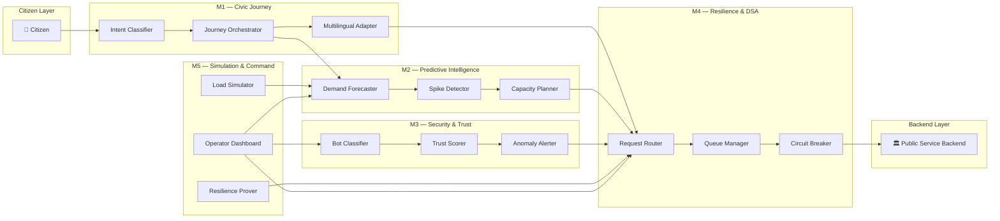
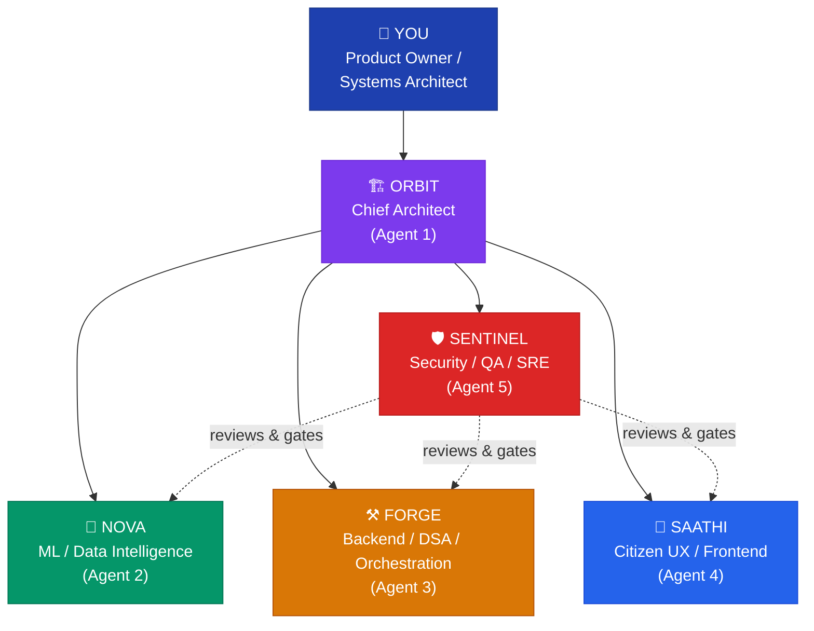

# PortalPulse Civic — Master PRD

> **Project Codename:** NIRANTAR
> **Status:** PLANNING
> **Created:** 2026-08-21
> **Owner:** Product Owner / Systems Architect (YOU)
> **Category:** AI-powered Public-Service Resilience & Journey Orchestration Platform
> **Flagship Demo:** Peak-demand railway/public-service transaction (IRCTC Tatkal-scale)

---

## 0. Product Definition

### Product Identity

| Field | Value |
|-------|-------|
| **Product Name** | PortalPulse Civic |
| **Product Category** | AI-powered Public-Service Resilience & Journey Orchestration Platform |
| **Flagship Demonstration** | Peak-demand railway/public-service transaction (IRCTC Tatkal-scale) |
| **Project Codename** | NIRANTAR |
| **Target Domains** | Indian Railways (IRCTC), EPFO, KMC, Banglarbhumi, BSK, and extensible to any digital public service |

### Core Problem

Indian digital public services suffer from two fundamentally disconnected failure domains:

#### Problem 1 — Citizen-Side Friction

Citizens face a hostile interface layer that actively discourages engagement:

- **Confusing forms** — deeply nested, jargon-laden, with no contextual guidance
- **Excessive information overload** — pages crammed with irrelevant content, burying the critical action
- **Language barriers** — English-first UIs in a nation of 22 scheduled languages and hundreds of dialects
- **Poor accessibility** — non-compliant with WCAG, hostile to screen readers, unusable on low-end devices
- **Complex multi-step workflows** — no journey memory, no progress indicators, no recovery paths

#### Problem 2 — System-Side Fragility

Backend infrastructure crumbles under real-world demand patterns:

- **Unpredictable demand spikes** — Tatkal windows, exam results, pension disbursement dates
- **Peak-time overload** — cascading failures when concurrent users exceed provisioned capacity
- **Cascading backend bottlenecks** — database locks, queue saturation, payment gateway timeouts
- **Abnormal/bot traffic** — scalpers, bots, and DDoS-like patterns mixed with legitimate users
- **Inefficient resource utilization** — over-provisioned during troughs, under-provisioned during peaks
- **Poor failure preparedness** — no graceful degradation, no circuit breakers, no predictive autoscaling

#### Research Basis

These problems are empirically validated across five representative Indian public-service portals:

| Portal | Primary Friction | Primary Fragility |
|--------|-----------------|-------------------|
| **IRCTC** | Complex booking flow, CAPTCHA fatigue, language gaps | Tatkal-window collapse (~10M concurrent), payment gateway timeouts |
| **EPFO** | Opaque claim status, multi-document upload confusion | Month-end spike overloads, OTP delivery failures |
| **KMC** | Property tax calculation complexity, receipt retrieval | Assessment period surges, legacy backend integration failures |
| **Banglarbhumi** | Land record search ambiguity, map rendering failures | Mutation application surges, GIS layer timeouts |
| **BSK** | Certificate application workflows, document requirements | Bulk application windows, verification queue saturation |

### The PortalPulse Thesis

> A public-service portal should understand **both** the citizen journey **AND** the infrastructure carrying that journey.

PortalPulse Civic creates a **bidirectional intelligence bridge** between citizen intent and system state:

```
Citizen
  → Intent Understanding (NLP / Voice / Multilingual)
    → Journey Orchestration (workflow simplification, form pre-fill)
      → Demand Prediction (time-series forecasting, spike detection)
        → Infrastructure Prediction (resource state, bottleneck forecasting)
          → Security & Anomaly Analysis (bot detection, traffic classification)
            → DSA Optimization (graph routing, queue management, load balancing)
              → Adaptive Intervention (circuit breakers, graceful degradation, autoscaling)
                → Public-Service Backend (IRCTC, EPFO, KMC, Banglarbhumi, BSK)
```

**Key insight:** Each layer feeds intelligence to the layers above and below it, creating a closed-loop system where citizen experience metrics inform infrastructure decisions and infrastructure state informs citizen-facing interventions.

---

## 1. Five-Module Architecture

PortalPulse Civic is organized around **five jobs to be done**, NOT around technologies. Each module owns a clear problem domain and produces measurable outcomes.

| Module | Job | Main Technologies | Key Deliverables |
|--------|-----|-------------------|------------------|
| **M1 — Civic Journey** | Understand and simplify citizen intent | OpenAI, NLP, voice recognition, multilingual (Indic NLP) | Intent classifier, form simplifier, journey orchestrator, multilingual adapter |
| **M2 — Predictive Intelligence** | Predict demand and infrastructure state | XGBoost, MLP, PyTorch, LSTM, time-series models | Demand forecaster, spike detector, resource state predictor, capacity planner |
| **M3 — Security & Trust** | Distinguish legitimate vs. abnormal traffic | CNN, behavioral models, Cairo (formal verification), anomaly detection | Bot classifier, traffic fingerprinter, trust scorer, anomaly alerter |
| **M4 — Resilience & DSA** | Decide what the system should do | Graphs, priority queues, optimization algorithms, circuit breakers | Request router, queue manager, load balancer, graceful degradation engine |
| **M5 — Simulation & Command Center** | Test, visualize, and prove resilience | GAN/VAE (synthetic load), load simulator, real-time dashboard | Scenario generator, load tester, resilience prover, operator dashboard |

### Module Interaction Model



### Module Ownership Matrix

| Module | Primary Agent | Supporting Agents | Integration Points |
|--------|--------------|-------------------|-------------------|
| M1 — Civic Journey | SAATHI | NOVA (NLP models), ORBIT (API contracts) | M2 (demand signals), M4 (routing decisions) |
| M2 — Predictive Intelligence | NOVA | ORBIT (schema design), FORGE (data pipelines) | M1 (intent volume), M4 (capacity triggers), M5 (synthetic data) |
| M3 — Security & Trust | SENTINEL | NOVA (anomaly models), FORGE (traffic ingestion) | M4 (trust scores for routing), M5 (attack simulation) |
| M4 — Resilience & DSA | FORGE | NOVA (prediction feeds), SENTINEL (security policy) | M1 (citizen routing), M2 (capacity signals), M3 (trust gates) |
| M5 — Simulation & Command | SENTINEL + SAATHI | NOVA (GAN/VAE), FORGE (load harness) | All modules (observability + control plane) |

---

## 2. Five Codex Agents

Each agent has a **clear ownership boundary**, a **codename**, and a **distinct set of deliverables**. Agents communicate through defined API contracts and shared schemas.

| Agent | Codename | Role | Owns | Primary Modules |
|-------|----------|------|------|-----------------|
| Agent 1 | **ORBIT** | Product + System Architecture | `/docs`, `/architecture`, `/api-contracts`, `/schemas`, ADRs | Cross-cutting |
| Agent 2 | **NOVA** | ML / Data Intelligence | `/ml`, `/data`, `/models`, `/training`, `/evaluation`, `/notebooks` | M2, M3 (models) |
| Agent 3 | **FORGE** | Backend + DSA + Orchestration | `/backend`, `/orchestrator`, `/graph`, `/queue`, `/services` | M4, M2 (pipelines) |
| Agent 4 | **SAATHI** | Citizen UX + Frontend + OpenAI | `/frontend`, `/citizen`, `/operator-dashboard`, `/i18n` | M1, M5 (dashboard) |
| Agent 5 | **SENTINEL** | Security + Testing + SRE | `/security`, `/tests`, `/load-tests`, `/chaos`, `/ci`, `/monitoring` | M3, M5 (simulation) |

### Agent Profiles

#### ORBIT — Chief Architect

- **Mandate:** Own the blueprint. Every API contract, schema, and architectural decision flows through ORBIT.
- **Outputs:** Architecture Decision Records (ADRs), OpenAPI specs, Protobuf/JSON schemas, module boundary definitions, dependency graphs.
- **Escalation:** ORBIT escalates to YOU (Product Owner) when cross-module tradeoffs require product-level decisions.

#### NOVA — Intelligence Engine

- **Mandate:** Own all machine learning — from data pipelines to trained models to evaluation harnesses.
- **Outputs:** Trained models (demand forecaster, bot classifier, anomaly detector), evaluation reports, dataset manifests, feature stores.
- **Constraints:** Models must be exportable (ONNX/TorchScript), latency-budgeted (< 50ms p99 for online inference), and reproducible (seed-locked training).

#### FORGE — System Builder

- **Mandate:** Own the runtime — every service, queue, graph, and orchestration pathway.
- **Outputs:** Microservices, message queues, graph-based routing engine, circuit breaker implementation, database schemas, deployment manifests.
- **Constraints:** Services must be stateless (state in Redis/Postgres), containerized (Docker), and horizontally scalable.

#### SAATHI — Citizen Advocate

- **Mandate:** Own the citizen experience — every screen, interaction, and word the citizen sees.
- **Outputs:** React/Next.js frontend, multilingual content, voice interface, form simplification engine, operator dashboard, accessibility audit reports.
- **Constraints:** WCAG 2.1 AA minimum, < 3s LCP on 3G, support for 10+ Indic languages, graceful offline fallbacks.

#### SENTINEL — Guardian

- **Mandate:** Own trust, testing, and operational reliability — nothing ships without SENTINEL's sign-off.
- **Outputs:** Security audit reports, penetration test results, load test harnesses, chaos engineering scenarios, CI/CD pipelines, monitoring dashboards, incident runbooks.
- **Constraints:** 100% critical-path test coverage, automated security scanning in CI, chaos tests must pass before release.

---

## 3. Organizational Model

### Hierarchy

```
YOU (Product Owner / Systems Architect)
 └── ORBIT (Chief Architect)
      ├── NOVA (ML/Data Intelligence)
      ├── FORGE (Backend/DSA/Orchestration)
      ├── SAATHI (Citizen UX/Frontend)
      └── SENTINEL (Security/QA/SRE)
           ├── Reviews NOVA outputs
           ├── Reviews FORGE outputs
           └── Reviews SAATHI outputs
```

### Hierarchy Diagram



### Communication Protocol

| From | To | Channel | Trigger |
|------|----|---------|---------|
| YOU | ORBIT | Direct directive | New feature, priority change, scope decision |
| ORBIT | NOVA / FORGE / SAATHI | Task assignment via ADR | Architecture plan approved |
| NOVA / FORGE / SAATHI | ORBIT | Completion report | Task done, blocker encountered |
| SENTINEL | NOVA / FORGE / SAATHI | Review feedback | PR submitted, test failure, security finding |
| SENTINEL | ORBIT | Gate report | Release readiness, SLA compliance |
| ORBIT | YOU | Escalation | Cross-module tradeoff, scope conflict, risk elevation |

### Decision Authority Matrix

| Decision Type | Authority | Escalation Path |
|--------------|-----------|-----------------|
| API contract changes | ORBIT | YOU (if breaking change) |
| Model architecture choices | NOVA | ORBIT (if latency/cost impact) |
| Infrastructure topology | FORGE | ORBIT (if cross-module) |
| UX flow changes | SAATHI | ORBIT (if data contract impact) |
| Security policy | SENTINEL | ORBIT → YOU (if user-facing impact) |
| Feature scope | YOU | — (final authority) |
| Release go/no-go | SENTINEL + ORBIT | YOU (if override needed) |

---

## 4. Alignment with AI Agent Company Framework

PortalPulse Civic's 5 NIRANTAR agents map cleanly to the existing 8-agent AI Agent Company framework. This ensures that all company-wide governance rules, review gates, and tooling integrations apply automatically.

### Agent Mapping

| NIRANTAR Agent | Company Agent(s) | Rationale |
|---------------|------------------|-----------|
| **ORBIT** | Agent 1 — Architect / Planner | Both own feature decomposition, dependency mapping, architecture design, and ADRs. ORBIT extends Agent 1 with domain-specific public-service architecture knowledge. |
| **NOVA** | Agent 3 — ML/LLM Specialist | Both own model training, prompt engineering, and evaluation. NOVA extends Agent 3 with demand forecasting, anomaly detection, and time-series specialization. |
| **FORGE** | Agent 2 — Lead Developer / Coder | Both own production code, following MASTER_CODER standards. FORGE extends Agent 2 with DSA optimization, queue management, and graph-based routing. |
| **SAATHI** | Agent 7 — UI Visual Designer + Agent 8 — UX Interaction Specialist | SAATHI combines both design agents — Agent 7's design tokens/component specs with Agent 8's journey mapping/accessibility audits. Extended with multilingual Indic support and voice interfaces. |
| **SENTINEL** | Agent 4 — Tester/QA + Agent 5 — Code Reviewer & Security Auditor + Agent 6 — File Warden | SENTINEL consolidates all quality/security/governance agents. Extends with chaos engineering, load testing, SRE runbooks, and public-service-specific compliance (GIGW, data localization). |

### Inherited Governance

By aligning with the company framework, NIRANTAR automatically inherits:

| Governance Rule | Source | Applied By |
|----------------|--------|------------|
| File size cap (300–500 lines) | Agent 6 — File Warden | SENTINEL |
| 5-pass code review gate | Agent 5 — Code Reviewer | SENTINEL |
| Adversarial testing | Agent 4 — Tester/QA | SENTINEL |
| Design token compliance | Agent 7 — UI Designer | SAATHI |
| WCAG accessibility audit | Agent 8 — UX Researcher | SAATHI |
| Obsidian mind-map sync | Agent 1 — Architect | ORBIT |
| Gratify / Headroom / Ponytail tooling | Framework-wide | All agents |

### Framework Extension Points

NIRANTAR adds domain-specific governance layers on top of the company framework:

| Extension | Description | Owner |
|-----------|-------------|-------|
| **GIGW Compliance** | Government of India Guidelines for Websites — mandatory for public-service UIs | SAATHI + SENTINEL |
| **Data Localization** | All citizen PII must reside in Indian data centers (Data Protection Act compliance) | FORGE + SENTINEL |
| **Indic Language Parity** | Every citizen-facing string must exist in ≥ 10 Indic languages | SAATHI |
| **Latency SLA** | Online ML inference < 50ms p99; API response < 200ms p99 | NOVA + FORGE |
| **Chaos Resilience** | System must survive simulated Tatkal-scale (10M concurrent) load with < 1% error rate | FORGE + SENTINEL |

---

## 5. Document Index

All PRD documents for PortalPulse Civic reside in this folder (`plans/portalpulse_civic/`):

| # | Document | Description | Status |
|---|----------|-------------|--------|
| 00 | `00_master_prd.md` | **This file.** Top-level PRD — product definition, architecture, agents, org model. | ✅ Active |
| 01 | `01_agent_orbit.md` | ORBIT agent profile — architecture ownership, ADR templates, API contract standards. | 🔲 Planned |
| 02 | `02_agent_nova.md` | NOVA agent profile — ML pipeline ownership, model registry, evaluation harnesses. | 🔲 Planned |
| 03 | `03_agent_forge.md` | FORGE agent profile — backend ownership, DSA specs, service contracts. | 🔲 Planned |
| 04 | `04_agent_saathi.md` | SAATHI agent profile — UX ownership, design system, multilingual standards. | 🔲 Planned |
| 05 | `05_agent_sentinel.md` | SENTINEL agent profile — security policy, test strategy, SRE runbooks. | 🔲 Planned |
| 06 | `06_module_architecture.md` | Detailed architecture for all 5 modules — data flows, component specs, latency budgets. | 🔲 Planned |
| 07 | `07_integration_contracts.md` | Inter-module API contracts — OpenAPI specs, event schemas, shared types. | 🔲 Planned |
| 08 | `08_repository_structure.md` | Monorepo layout — directory structure, ownership map, CI/CD file conventions. | 🔲 Planned |
| 09 | `09_verification_plan.md` | End-to-end verification strategy — unit, integration, load, chaos, acceptance. | 🔲 Planned |

---

## 6. Risk Register

| # | Risk | Impact | Probability | Mitigation |
|---|------|--------|-------------|------------|
| R1 | **Tatkal-scale simulation inaccuracy** — synthetic load doesn't match real IRCTC traffic patterns | High | Medium | Validate GAN/VAE-generated traffic against anonymized IRCTC access logs; iteratively calibrate with NOVA |
| R2 | **Multilingual NLP quality** — Indic language models underperform on low-resource languages | High | High | Start with top-5 languages (Hindi, Bengali, Tamil, Telugu, Marathi); use fine-tuned multilingual models; community validation |
| R3 | **Bot classifier false positives** — legitimate citizens flagged as bots during peak load | Critical | Medium | Graduated trust scoring (not binary); human-in-the-loop override path; continuous calibration with SENTINEL |
| R4 | **Cross-module latency budget blow** — chained M1→M2→M3→M4 calls exceed 200ms API SLA | High | Medium | Parallel evaluation where possible; pre-computed predictions; circuit-break slow modules; latency budget per module |
| R5 | **Data localization compliance** — cloud provider regions may not satisfy all Data Protection Act requirements | High | Low | Architect for India-region-only deployment from day one; no cross-border data flows for PII |
| R6 | **Agent coordination overhead** — 5 agents with complex dependencies slow development velocity | Medium | Medium | Clear ownership boundaries (this PRD); automated contract testing; weekly sync cadence |
| R7 | **Scope creep across portals** — expanding beyond IRCTC flagship before core is proven | High | High | Hard scope lock on IRCTC Tatkal demo until M1–M5 pass verification plan; other portals are Phase 2 |

---

## 7. Success Criteria

### Flagship Demo (IRCTC Tatkal-Scale)

| Metric | Target | Measurement |
|--------|--------|-------------|
| **Peak concurrent users simulated** | ≥ 1M (stretch: 10M) | M5 load simulator |
| **API response latency (p99)** | < 200ms | M4 instrumentation |
| **ML inference latency (p99)** | < 50ms | M2/M3 model benchmarks |
| **Bot detection accuracy** | ≥ 95% precision, ≥ 90% recall | M3 evaluation harness |
| **Demand prediction MAPE** | < 15% (1-hour horizon) | M2 backtesting |
| **Citizen journey completion rate** | ≥ 80% (up from ~40% baseline) | M1 funnel analytics |
| **System error rate under peak load** | < 1% | M5 chaos + load tests |
| **Language coverage** | ≥ 10 Indic languages | M1 multilingual adapter |
| **WCAG 2.1 AA compliance** | 100% critical paths | SAATHI accessibility audit |
| **Graceful degradation** | Maintain core function at 150% capacity | M4 circuit breaker tests |

### Agent Delivery Milestones

| Phase | Milestone | Owner | Dependency |
|-------|-----------|-------|------------|
| **Phase 0** | Master PRD + all agent profiles complete | ORBIT | — |
| **Phase 1** | Module architecture + integration contracts defined | ORBIT | Phase 0 |
| **Phase 2** | Repository structure + CI/CD pipeline operational | SENTINEL + FORGE | Phase 1 |
| **Phase 3** | M1 intent classifier + M2 demand forecaster MVP | NOVA + SAATHI | Phase 2 |
| **Phase 4** | M3 bot classifier + M4 routing engine MVP | NOVA + FORGE + SENTINEL | Phase 2 |
| **Phase 5** | M5 simulation harness + operator dashboard | SENTINEL + SAATHI | Phase 3, 4 |
| **Phase 6** | Integrated end-to-end Tatkal demo | All agents | Phase 5 |
| **Phase 7** | Verification plan execution + release gate | SENTINEL | Phase 6 |

---

## 8. Glossary

| Term | Definition |
|------|-----------|
| **NIRANTAR** | Project codename — Hindi for "continuous / uninterrupted", reflecting the resilience mission |
| **Tatkal** | IRCTC's premium last-minute booking window — the canonical peak-demand scenario |
| **DSA** | Data Structures & Algorithms — used here to mean graph routing, queue optimization, and algorithmic load balancing |
| **GIGW** | Guidelines for Indian Government Websites — mandatory compliance for public-service portals |
| **Circuit Breaker** | A resilience pattern that stops cascading failures by failing fast when a downstream service is unhealthy |
| **GAN/VAE** | Generative Adversarial Network / Variational Autoencoder — used in M5 to synthesize realistic load patterns |
| **MAPE** | Mean Absolute Percentage Error — primary metric for demand prediction accuracy |
| **LCP** | Largest Contentful Paint — web performance metric, target < 3s on 3G |
| **ADR** | Architecture Decision Record — documented rationale for significant technical choices |

---

*Built under the AI Agent Company framework — autonomous, quality-gated, production-ready.*
*Project NIRANTAR — निरंतर — continuous, uninterrupted, resilient.*
