# 06 — Module Architecture

> **Project**: PortalPulse Civic (NIRANTAR)
> **Last Updated**: 2026-08-21
> **Status**: Draft

---

## Overview

NIRANTAR is composed of **five modules**, each owned by a designated agent. Data flows linearly from citizen input (M1) through intelligence and security layers (M2, M3) into a central orchestration engine (M4), with M5 sitting outside the hot path to test and visualize the integrated system.

---

## Data-Flow Diagram

```mermaid
flowchart LR
    Citizen(("Citizen\n(text / voice)"))

    subgraph M1["M1 — Civic Journey"]
        IE["intent_extractor"]
        JB["journey_builder"]
        VI["voice_interface"]
        LR["language_router"]
    end

    subgraph M2["M2 — Predictive Intelligence"]
        CM["capacity_model"]
        PM["pytorch_model"]
        LF["lstm_forecast"]
        AD["anomaly_detector"]
    end

    subgraph M3["M3 — Security & Trust"]
        TC["traffic_classifier"]
        BA["behavior_analyzer"]
        RL["rate_limiter"]
        TS["threat_scorer"]
    end

    subgraph M4["M4 — Resilience & DSA"]
        SG["service_graph"]
        CP["critical_path"]
        QE["queue_engine"]
        ORC["orchestrator"]
    end

    subgraph M5["M5 — Simulation & Command Center"]
        TG["traffic_generator"]
        LS["load_simulator"]
        CE["chaos_engine"]
        DB["dashboard"]
    end

    Backend[("Public-Service\nBackend")]

    Citizen --> M1
    M1 -- "JourneyObject" --> M4
    M2 -- "PredictionResult" --> M3
    M2 -- "PredictionResult" --> M4
    M3 -- "TrustDecision" --> M4
    M4 -- "OrchestrationAction" --> Backend
    M4 -. "Telemetry" .-> M2
    M5 -. "Simulated load" .-> M1
    M5 -. "Fault injection" .-> M4
```



---

## Agent ↔ Module Mapping

| Module | Name | Owner Agent | Primary Responsibility |
|--------|------|-------------|------------------------|
| M1 | Civic Journey | **SAATHI** | Citizen intent understanding |
| M2 | Predictive Intelligence | **NOVA** | Demand forecasting & anomaly detection |
| M3 | Security & Trust | **SENTINEL** | Bot detection & adaptive rate limiting |
| M4 | Resilience & DSA | **FORGE** | Orchestration & graceful degradation |
| M5 | Simulation & Command Center | **SENTINEL + NOVA** | Load testing, chaos, dashboards |

---

## M1 — Civic Journey

| Field | Value |
|-------|-------|
| **Owner** | SAATHI |
| **Job** | Understand and simplify citizen intent |
| **Technologies** | OpenAI GPT-4, NLP pipelines, voice recognition, multilingual models |
| **Dependencies** | None (entry point) |

### Key Components

| File | Purpose |
|------|---------|
| `intent_extractor.py` | NLP pipeline for parsing and classifying citizen queries |
| `journey_builder.py` | Constructs structured `JourneyObject` from extracted intent |
| `voice_interface.py` | Speech-to-text and text-to-speech bridge |
| `language_router.py` | Multilingual routing across supported languages (`hi`, `bn`, `en`, `ta`) |
| `progressive_ui/` | Frontend components implementing progressive disclosure |

### Interfaces

- **Input**: Raw citizen input — text or voice, in any supported language.
- **Output**: `JourneyObject` → consumed by **M4**.

---

## M2 — Predictive Intelligence

| Field | Value |
|-------|-------|
| **Owner** | NOVA |
| **Job** | Predict demand and infrastructure state |
| **Technologies** | XGBoost, MLP, PyTorch, LSTM / GRU |
| **Dependencies** | Telemetry streams from **M4** |

### Key Components

| File | Purpose |
|------|---------|
| `capacity_model.py` | XGBoost-based demand forecasting |
| `pytorch_model.py` | Multi-output neural network for complex predictions |
| `lstm_forecast.py` | LSTM / GRU time-series forecasting |
| `anomaly_detector.py` | Statistical and ML-driven anomaly detection |
| `feature_engine.py` | Feature engineering pipeline (lag, rolling, calendar) |
| `model_registry.py` | Model versioning, A/B serving, and rollback |

### Interfaces

- **Input**: Telemetry streams, historical data, current load metrics.
- **Output**: `PredictionResult` (demand forecast, overload probability, anomaly scores) → consumed by **M3** and **M4**.

---

## M3 — Security & Trust

| Field | Value |
|-------|-------|
| **Owner** | SENTINEL |
| **Job** | Distinguish legitimate vs abnormal traffic |
| **Technologies** | CNN behavior models, Cairo security primitives, adaptive rate limiting |
| **Dependencies** | Anomaly scores from **M2** |

### Key Components

| File | Purpose |
|------|---------|
| `traffic_classifier.py` | CNN-based bot detection and request classification |
| `behavior_analyzer.py` | User behavior profiling using session fingerprints |
| `rate_limiter.py` | Adaptive rate limiting driven by M2 anomaly scores |
| `threat_scorer.py` | Composite threat scoring engine (0 – 100 scale) |

### Interfaces

- **Input**: Raw request streams, `PredictionResult.anomaly_scores` from M2.
- **Output**: `TrustDecision` (allow / throttle / block + threat score) → consumed by **M4**.

---

## M4 — Resilience & DSA

| Field | Value |
|-------|-------|
| **Owner** | FORGE |
| **Job** | Decide what the system should do — central orchestration |
| **Technologies** | Graph algorithms, priority queues, optimization solvers |
| **Dependencies** | **M1** (JourneyObject), **M2** (PredictionResult), **M3** (TrustDecision) |

### Key Components

| File | Purpose |
|------|---------|
| `service_graph.py` | Dependency graph of all backend micro-services |
| `critical_path.py` | Critical-path algorithm for request routing |
| `queue_engine.py` | Admission control and priority queuing |
| `load_shedder.py` | Graceful degradation under overload conditions |
| `orchestrator.py` | Central orchestration engine combining all signals |
| `cache_layer.py` | Intelligent caching with TTL and invalidation logic |

### Interfaces

- **Input**: `JourneyObject` (M1), `PredictionResult` (M2), `TrustDecision` (M3).
- **Output**: `OrchestrationAction` → routed to the public-service backend.

> [!IMPORTANT]
> M4 is the convergence point — every request passes through the orchestrator before reaching any backend service. Outages here cascade system-wide.

---

## M5 — Simulation & Command Center

| Field | Value |
|-------|-------|
| **Owner** | SENTINEL + NOVA (joint) |
| **Job** | Test, visualize, and prove resilience |
| **Technologies** | GAN / VAE traffic generation, load simulators, real-time dashboards |
| **Dependencies** | All modules (tests the integrated system end-to-end) |

### Key Components

| File | Purpose |
|------|---------|
| `traffic_generator.py` | GAN-based realistic traffic simulation |
| `load_simulator.py` | Configurable load testing (ramp, spike, soak) |
| `chaos_engine.py` | Fault injection — latency, drop, partition |
| `dashboard/` | Real-time command center UI with live metrics |
| `benchmark_suite.py` | Performance benchmarking and regression tracking |

### Interfaces

- **Input**: System configuration, scenario definitions (YAML / JSON).
- **Output**: `SimulationReport`, real-time metrics streamed to `dashboard/`.

> [!NOTE]
> M5 operates **outside the hot path**. It injects synthetic load and faults into M1 and M4 to validate resilience without affecting production traffic during normal operation.

---

## Cross-Module Data Contracts

| Contract | Producer | Consumer | Format |
|----------|----------|----------|--------|
| `JourneyObject` | M1 | M4 | JSON — intent, language, urgency, session ID |
| `PredictionResult` | M2 | M3, M4 | JSON — forecast array, overload probability, anomaly scores |
| `TrustDecision` | M3 | M4 | JSON — action enum, threat score, reason codes |
| `OrchestrationAction` | M4 | Backend | JSON — route, priority, cache hint, degradation level |
| `SimulationReport` | M5 | Operators | JSON — pass/fail, latency percentiles, error rates |

---

## Dependency Summary

```
M1 ──────────────────────────────► M4 ──► Backend
M2 ──► M3 ──────────────────────►╱
M2 ─────────────────────────────►╱
M4 ·····(telemetry)·····► M2
M5 ·····(simulation)····► M1, M4
```

- **Solid arrows** → runtime data flow.
- **Dotted arrows** → feedback / offline channels.
