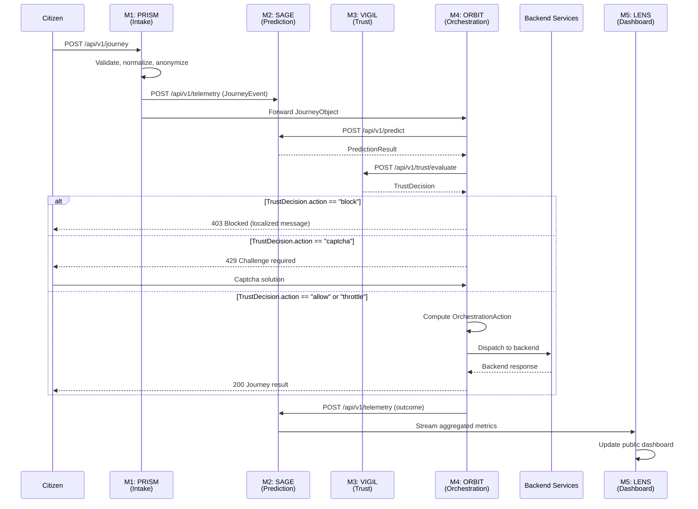

# 07 — Integration Contracts

> **Project:** PortalPulse Civic (NIRANTAR)
> **Owner:** ORBIT (Orchestration & Integration Agent)
> **Status:** Draft
> **Last Updated:** 2026-08-21

---

## 1. Overview

This document defines the canonical API contracts and data schemas governing communication between the five modules of PortalPulse Civic. All inter-module data exchange **must** conform to these contracts. ORBIT is the sole authority for contract changes; any modification requires a versioned migration plan.

### Module Reference

| Module | Name | Primary Role |
|--------|------|--------------|
| M1 | Citizen Journey Intake | Captures and normalizes citizen requests |
| M2 | Predictive Intelligence | Demand forecasting, anomaly detection, telemetry |
| M3 | Trust & Threat Assessment | Bot detection, threat scoring, access decisions |
| M4 | Orchestration Engine | Queue management, load balancing, routing |
| M5 | Transparency Dashboard | Real-time metrics, simulation, public visibility |

---

## 2. Data Schemas

### 2.1 JourneyObject (M1 → M4)

Represents a single citizen interaction from intake through fulfillment.

```json
{
  "journey_id": "uuid",
  "citizen_id": "string (anonymized)",
  "intent": "enum: book_train | check_status | file_complaint | apply_service",
  "origin": "string",
  "destination": "string",
  "date": "ISO-8601",
  "time_preference": "enum: morning | afternoon | evening | night",
  "language": "enum: hi | bn | en | ta | te | mr",
  "priority": "enum: normal | tatkal | premium_tatkal",
  "accessibility_needs": ["enum: screen_reader | large_text | voice_only"],
  "timestamp": "ISO-8601",
  "session_id": "uuid"
}
```

> [!IMPORTANT]
> `citizen_id` is a one-way hash. Raw PII must never cross module boundaries.

### 2.2 PredictionResult (M2 → M3, M4)

Output of the predictive intelligence pipeline, consumed by both trust evaluation and orchestration.

```json
{
  "prediction_id": "uuid",
  "timestamp": "ISO-8601",
  "demand_forecast": {
    "current_rps": "float",
    "predicted_peak_rps": "float",
    "time_to_peak_minutes": "int",
    "confidence": "float [0-1]"
  },
  "overload_probability": "float [0-1]",
  "anomaly_scores": {
    "traffic_anomaly": "float [0-1]",
    "pattern_anomaly": "float [0-1]",
    "geographic_anomaly": "float [0-1]"
  },
  "model_version": "string",
  "features_used": ["string"]
}
```

### 2.3 TrustDecision (M3 → M4)

Per-session trust verdict that gates access to backend services.

```json
{
  "decision_id": "uuid",
  "session_id": "uuid",
  "action": "enum: allow | throttle | captcha | block",
  "threat_score": "float [0-1]",
  "threat_category": "enum: legitimate | suspicious | bot | ddos",
  "evidence": ["string"],
  "ttl_seconds": "int"
}
```

### 2.4 OrchestrationAction (M4 → Backend)

The resolved action plan that M4 dispatches to downstream services.

```json
{
  "action_id": "uuid",
  "journey_id": "uuid",
  "actions": [
    {
      "type": "enum: queue | route | shed_load | cache_serve | throttle | failover",
      "target_service": "string",
      "parameters": {}
    }
  ],
  "queue_position": "int | null",
  "estimated_wait_seconds": "int | null",
  "fallback_strategy": "enum: retry | degrade | offline_mode"
}
```

### 2.5 TelemetryEvent (All Modules → M2)

Universal telemetry envelope. Every module emits these; M2 ingests and aggregates.

```json
{
  "event_id": "uuid",
  "source_module": "enum: M1 | M2 | M3 | M4 | M5",
  "event_type": "enum: request | response | error | metric | heartbeat",
  "timestamp": "ISO-8601",
  "latency_ms": "float",
  "status_code": "int",
  "metadata": {}
}
```

---

## 3. API Contracts

All endpoints require `Content-Type: application/json`. Authentication uses bearer tokens issued by the platform IAM (`Authorization: Bearer <token>`). Rate limits are per-client unless noted.

### 3.1 POST /api/v1/journey — Create Journey

| Field | Value |
|-------|-------|
| **Owner Module** | M1 |
| **Owner Agent** | PRISM |
| **Auth** | Bearer token (citizen session) |
| **Rate Limit** | 500 req/s per IP, 50 req/s per citizen |

**Request Body:** `JourneyObject` (see §2.1)

**Response (201 Created):**
```json
{
  "journey_id": "uuid",
  "queue_position": "int | null",
  "estimated_wait_seconds": "int | null",
  "status": "enum: accepted | queued | rejected",
  "message": "string (localized)"
}
```

### 3.2 GET /api/v1/journey/{id}/status — Journey Status

| Field | Value |
|-------|-------|
| **Owner Module** | M4 |
| **Owner Agent** | ORBIT |
| **Auth** | Bearer token (citizen session) |
| **Rate Limit** | 200 req/s per IP |

**Response (200 OK):**
```json
{
  "journey_id": "uuid",
  "status": "enum: queued | processing | completed | failed | expired",
  "queue_position": "int | null",
  "estimated_wait_seconds": "int | null",
  "last_updated": "ISO-8601",
  "result": {} 
}
```

### 3.3 POST /api/v1/predict — Get Prediction

| Field | Value |
|-------|-------|
| **Owner Module** | M2 |
| **Owner Agent** | SAGE |
| **Auth** | Internal service token |
| **Rate Limit** | 1000 req/s (internal) |

**Request Body:**
```json
{
  "window_minutes": "int (default: 15)",
  "region": "string | null",
  "include_anomaly_scores": "bool (default: true)"
}
```

**Response (200 OK):** `PredictionResult` (see §2.2)

### 3.4 POST /api/v1/trust/evaluate — Evaluate Trust

| Field | Value |
|-------|-------|
| **Owner Module** | M3 |
| **Owner Agent** | VIGIL |
| **Auth** | Internal service token |
| **Rate Limit** | 2000 req/s (internal) |

**Request Body:**
```json
{
  "session_id": "uuid",
  "ip_address": "string",
  "user_agent": "string",
  "behavioral_signals": {
    "mouse_entropy": "float",
    "keystroke_cadence_ms": "float",
    "scroll_pattern": "string"
  },
  "prediction_context": "PredictionResult | null"
}
```

**Response (200 OK):** `TrustDecision` (see §2.3)

### 3.5 POST /api/v1/orchestrate — Execute Orchestration

| Field | Value |
|-------|-------|
| **Owner Module** | M4 |
| **Owner Agent** | ORBIT |
| **Auth** | Internal service token |
| **Rate Limit** | 1500 req/s (internal) |

**Request Body:**
```json
{
  "journey": "JourneyObject",
  "prediction": "PredictionResult",
  "trust_decision": "TrustDecision"
}
```

**Response (200 OK):** `OrchestrationAction` (see §2.4)

### 3.6 POST /api/v1/telemetry — Ingest Telemetry

| Field | Value |
|-------|-------|
| **Owner Module** | M2 |
| **Owner Agent** | SAGE |
| **Auth** | Internal service token |
| **Rate Limit** | 5000 req/s (batch supported) |

**Request Body:**
```json
{
  "events": ["TelemetryEvent"]
}
```

**Response (202 Accepted):**
```json
{
  "accepted": "int",
  "rejected": "int",
  "errors": ["string"]
}
```

> [!TIP]
> Batch up to 100 events per request to reduce overhead. M2 buffers internally with a 500ms flush window.

### 3.7 GET /api/v1/dashboard/metrics — Dashboard Metrics

| Field | Value |
|-------|-------|
| **Owner Module** | M5 |
| **Owner Agent** | LENS |
| **Auth** | Bearer token (admin or public read) |
| **Rate Limit** | 100 req/s per IP |

**Query Parameters:** `window` (5m | 15m | 1h | 24h), `modules` (comma-separated)

**Response (200 OK):**
```json
{
  "timestamp": "ISO-8601",
  "window": "string",
  "modules": {
    "M1": { "rps": "float", "p99_latency_ms": "float", "error_rate": "float" },
    "M2": { "prediction_accuracy": "float", "inference_latency_ms": "float" },
    "M3": { "threats_blocked": "int", "false_positive_rate": "float" },
    "M4": { "queue_depth": "int", "avg_wait_seconds": "float", "shed_rate": "float" },
    "M5": { "dashboard_latency_ms": "float", "active_viewers": "int" }
  },
  "system": {
    "total_rps": "float",
    "healthy_nodes": "int",
    "overall_availability": "float"
  }
}
```

### 3.8 POST /api/v1/simulate — Run Simulation

| Field | Value |
|-------|-------|
| **Owner Module** | M5 |
| **Owner Agent** | LENS |
| **Auth** | Bearer token (admin only) |
| **Rate Limit** | 10 req/min per user |

**Request Body:**
```json
{
  "scenario": "enum: tatkal_rush | regional_surge | ddos_attack | node_failure",
  "parameters": {
    "peak_rps": "int",
    "duration_minutes": "int",
    "geographic_distribution": {}
  },
  "dry_run": "bool (default: true)"
}
```

**Response (200 OK):**
```json
{
  "simulation_id": "uuid",
  "scenario": "string",
  "results": {
    "projected_queue_depth": "int",
    "projected_wait_seconds": "int",
    "estimated_success_rate": "float",
    "bottleneck_modules": ["string"],
    "recommended_actions": ["string"]
  }
}
```

---

## 4. Citizen Journey — End-to-End Sequence



---

## 5. Contract Versioning & Governance

| Rule | Detail |
|------|--------|
| **Versioning** | All endpoints are prefixed `/api/v1/`. Breaking changes increment the version. |
| **Deprecation** | Minimum 30-day notice before removing a field or endpoint. |
| **Schema Registry** | All schemas are registered in the shared protobuf/JSON-Schema registry. |
| **Change Authority** | ORBIT approves all contract changes; SAGE and VIGIL co-sign for their schemas. |
| **Backward Compat** | New fields default to `null`; consumers must tolerate unknown fields. |
| **SLA** | Internal endpoints: p99 < 50ms. Citizen-facing: p99 < 200ms. |
